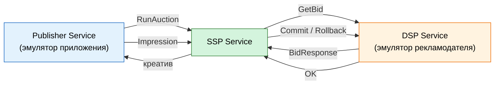
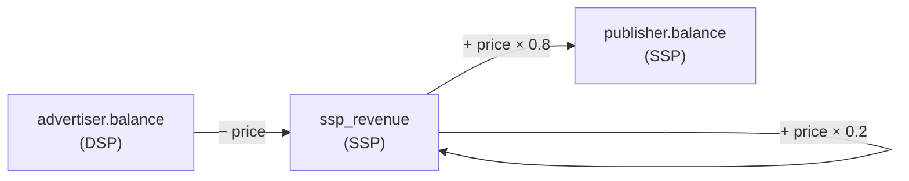

# MVP-сценарий MiniSSP

Полный цикл RTB: от запроса площадки до списания денег с рекламодателя.

## Роли

Три сервиса, общение по gRPC.



**Publisher Service** — эмулятор приложения издателя.
- Генерирует запросы на показ.
- Получает креатив победителя.
- «Показывает» его.
- Шлёт событие impression.
- Своего баланса не хранит — читает из SSP.

**SSP Service** — наша платформа.
- Принимает запросы от Publisher.
- Владеет слотами и издателями.
- Проводит аукцион second-price.
- Ведёт баланс издателя и свой доход.
- Публикует события в Kafka.

**DSP Service** — эмулятор рекламодателя.
- Принимает запросы от SSP.
- Владеет кампаниями, креативами, бюджетами.
- Резервирует и списывает деньги.
- Отвечает на запросы ставок.

## Полный цикл

1. **Publisher** шлёт `RunAuction` в SSP: `slot_id, geo, user_id`.
2. **SSP** достаёт слот из PostgreSQL (или Redis-кэша).
3. **SSP** шлёт `GetBid` в DSP: `slot_id, width, height, geo, bid_floor, user_id`.
4. **DSP** отбирает подходящие кампании, резервирует бюджет (`budget_reserved += price`) и возвращает `BidResponse`.
5. **SSP** выбирает победителя по second-price.
6. **SSP** возвращает Publisher: `creative_url, click_url, price`.
7. **Publisher** «показывает» баннер и шлёт `Impression(auction_id)`.
8. **SSP** инициирует `Commit(auction_id)` в DSP.
9. **DSP** списывает бюджет: `budget_remaining -= price`, `budget_reserved -= price`, отвечает `OK`.
10. **SSP** начисляет: `publisher.balance += price * 0.8`, `ssp_revenue += price * 0.2`.
11. **SSP** публикует событие `impression` в Kafka.
12. Если impression не пришёл за 30 секунд — DSP сам откатывает резерв по TTL в Redis.

## Поток денег



**Комиссия платформы** — 20%, константа в конфиге SSP.

**Инициатор Commit** — SSP. Он знает про impression от Publisher, поэтому только он решает, когда списывать бюджет.

## Модель данных

**SSP:**
```
publishers     id, name, balance
ad_slots       id, publisher_id, name, width, height, geo, min_price
ssp_revenue    id, balance, commission_percent
```

**DSP:**
```
advertisers    id, name, balance
campaigns      id, advertiser_id, name,
               budget_total, budget_remaining, budget_reserved, geo_target
creatives      id, campaign_id, width, height, url, click_url
```

**ClickHouse (события):**
```
events         type, auction_id, slot_id, campaign_id, price,
               publisher_revenue, platform_fee, timestamp
```

## События в Kafka

| Топик | Кто публикует | Кто читает |
|---|---|---|
| `auction_won` | SSP | Event Collector |
| `impression` | SSP | Event Collector |
| `click` | SSP | Event Collector |

Клик логируется, но денег за него не берём. Биллинг — только за показы.

## Что не входит в MVP

- Реальные платежи.
- Личный кабинет.
- SDK для мобильных приложений.
- Таргетинг по интересам, полу, возрасту.
- Мультивалютность.
- Биллинг кликов.