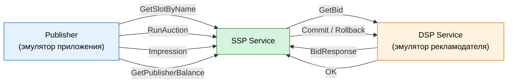
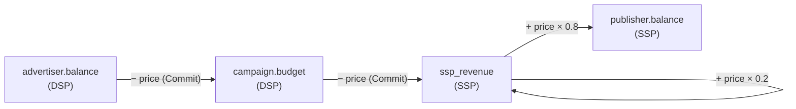

# MVP-сценарий MiniSSP

Полный цикл RTB: от запроса площадки до списания денег с рекламодателя.

## Роли

Три сервиса, общение по gRPC.

**Publisher** — эмулятор приложения издателя (runner, не сервис).
- Дёргает SSP в цикле: `RunAuction` → пауза → `Impression`.
- Получает креатив победителя, «показывает» его, подтверждает показ.
- Своего gRPC-сервера и БД не имеет. Баланс читает из SSP.
- Реализация — `internal/publisher/`, `cmd/publisher/`.

**SSP** — платформа на стороне издателя.
- Принимает запросы от Publisher, аутентифицирует по `api-key`.
- Владеет слотами и издателями, ведёт их балансы.
- Проводит аукцион second-price, хранит `AuctionRecord` до Impression или TTL.
- Инициирует Commit/Rollback в DSP.
- Публикует события в Kafka (планируется).

**DSP** — эмулятор платформы рекламодателя.
- Принимает GetBid/Commit/Rollback от SSP.
- Владеет кампаниями, креативами, бюджетами и балансами рекламодателей.
- Резервирует бюджет на стадии GetBid, списывает на Commit.

## Полный цикл

1. **Publisher** при старте резолвит слот: `GetSlotByName(name)` → `slot_id`.
2. **Publisher** шлёт `RunAuction(request_id, slot_id, user_id)`.
3. **SSP** достаёт слот из хранилища (Postgres + Redis-кэш в целевой версии).
4. **SSP** генерирует `imp_id` (UUID) — это внутренний идентификатор показа,
   Publisher его не присылает.
5. **SSP** шлёт параллельно `GetBid` всем DSP-биддерам:
   `request_id, imp_id, slot_id, geo, bid_floor, type, params, user_id`.
6. **DSP** отбирает кампании по geo с доступным бюджетом, ищет креатив,
   подходящий слоту по типу и параметрам, резервирует бюджет
   (`budget_remaining -= price`, `budget_reserved += price`) и возвращает `BidResponse`.
   Если ни одна кампания не подходит — `NotFound` (SSP мапит в `ErrNoBids`).
7. **SSP** собирает ставки, выбирает победителя по second-price
   (цена = max(вторая ставка, bid_floor)).
8. **SSP** сохраняет `AuctionRecord` со статусом `pending` и возвращает
   Publisher'у `auction_id, creative_url, click_url`.
9. **Publisher** «показывает» баннер и через `impression_delay` шлёт
   `Impression(auction_id)`.
10. **SSP** атомарно переводит `AuctionRecord` в `processing`, инициирует
    `Commit(auction_id, campaign_id, price)` в DSP-победителе.
11. **DSP** списывает бюджет (`budget_reserved -= price`), списывает с баланса
    рекламодателя (`advertiser.balance -= price`), отвечает `OK`.
12. **SSP** начисляет Publisher'у: `publisher.balance += price * (100 - commission) / 100`,
    переводит запись в `committed`.
13. **SSP** публикует событие `impression` в Kafka (планируется).

### Откат по TTL

Если Impression не пришёл за `AuctionTTL` (30 секунд):

- **сейчас (in-memory)**: фоновый воркер `processExpired` раз в 5 секунд находит
  просроченные `AuctionRecord`, отправляет `Rollback` в DSP, помечает запись
  как `rolled_back`.
- **после перехода на Redis**: TTL-ключ в Redis с истечением заменит воркер;
  событие `expired` через pub/sub триггерит тот же Rollback.

DSP возвращает зарезервированное: `budget_reserved -= price`,
`budget_remaining += price`.

## Поток денег

**Комиссия платформы** — 20% (`CommissionPercent` в `ssp/service/service.go`).

**Инициатор Commit** — SSP. Он знает про Impression от Publisher, поэтому
только он решает, когда списывать бюджет.

## Идемпотентность

| Операция | Ключ | Гарантия |
|---|---|---|
| `RegisterSlot` | `(publisher_id, name)` | Повторный вызов возвращает тот же слот |
| `Impression` | `auction_id` | Повторный вызов — no-op, второго списания нет |
| `RunAuction` | — | Каждый вызов создаёт новый `auction_id` |
| `Commit` / `Rollback` в DSP | `(campaign_id, price)` | Не идемпотентны, но вызываются один раз по state machine SSP |

## Конкурентные операции

| Операция | Что защищено |
|---|---|
| `RegisterSlot` | `AddIfAbsent` — атомарно в репозитории |
| `Impression` × N | `takeForImpression` — атомарно под локом |
| `Impression` vs `processExpired` | Оба берут запись через `takeAuction`; победитель один |
| `Campaign.Reserve/Commit/Rollback` | `sync.RWMutex` в in-memory; атомарный `UPDATE` в Postgres |

## Модель данных

**SSP:**

    publishers       id, name, api_key, balance
    ad_slots         id, publisher_id, name, geo, min_price, type,
                     banner_width, banner_height,
                     video_width, video_height, video_duration, video_mimes
    auctions         auction_id, imp_id, campaign_id, creative_id, publisher_id,
                     slot_id, bidder_id, price, status, created_at

**DSP:**

    advertisers      id, name, balance
    campaigns        id, advertiser_id, name,
                     budget_total, budget_remaining, budget_reserved, geo_target
    creatives        id, campaign_id, type, url, click_url, params

**ClickHouse (планируется):**

    events           type, auction_id, slot_id, campaign_id, price,
                     publisher_revenue, platform_fee, timestamp

Схема PostgreSQL подробно описана в [Схема БД](scheme-db.md).

## События в Kafka (планируется)

| Топик | Кто публикует | Кто читает |
|---|---|---|
| `auction_won` | SSP | Event Collector |
| `impression` | SSP | Event Collector, Billing, Anti-fraud |
| `click` | SSP | Event Collector |

Клик логируется, но денег за него не берём. Биллинг — только за показы.

## Границы MVP

**Входит:**
- Publisher регистрирует слот через gRPC API.
- Advertiser регистрирует кампанию с бюджетом.
- Простой geo-таргетинг.
- Аукцион second-price с учётом бюджета.
- Резерв цены, коммит после подтверждения показа.
- Три счёта: advertiser, publisher, platform.
- Метрики в Prometheus → Grafana.

**Не входит:**
- Реальные платежи и интеграции с банками.
- Личный кабинет и веб-интерфейс.
- SDK для мобильных приложений.
- Таргетинг по интересам, полу, возрасту.
- Биллинг кликов.
- Мультивалютность.

## Связанные документы

- [ADR 003. Границы MVP](../decisions/003-mvp-scope.md)
- [ADR 006. Трёхсервисная архитектура](../decisions/006-three-service-architecture.md)
- [Схема БД](scheme-db.md).
- [Термины AdTech](../notes/adtech-terms.md)