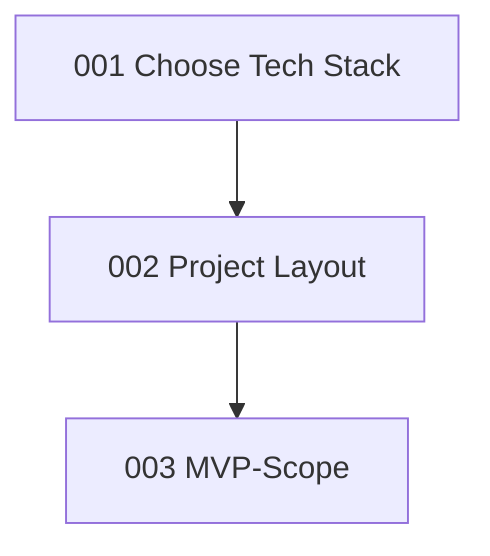

# Architecture Decision Records

| № | Решение | Статус | Дата |
|---|---|---|---|
| [001](001-choose-tech-stack.md) | Стек и способ запуска | Принято | 2026-09-22 |
| [002](002-project-layout.md) | Структура папок | Принято | 2026-09-23 |
| [003](003-mvp-scope.md) | Границы MVP | Принято | 2026-09-25 |

## Граф решений

## Связанные разделы

- [Архитектура](../architecture/INDEX.md) 
- [Заметки](../notes/INDEX.md) 